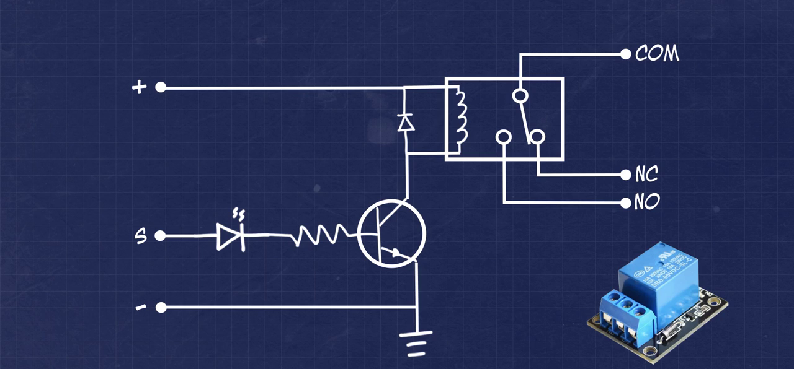

# IoT Water Monitoring and Conservation
  This Arduino code is designed to monitor the water level, consumption, and turbidity of a tank or reservoir. It uses a variety of sensors and hardware components to collect this data and store it in a local SD card for later analysis.
  The program runs on an ESP32 microcontroller with WiFi capabilities.

## Features
  * Monitors water level using an ultrasonic distance sensor and turns the pump on or off as needed to maintain the water level within a certain range
  * Logs data to an SD card, including date and time stamps, turbidity, and total water flow
  * Provides a web interface for viewing the data log and downloading data files

## Hardware
  * DOIT ESP32 DevKit V1 board for controlling operations
  * HC-SR04 ultrasonic sensor for measuring water level
  * YF-S201C flow sensor for measuring flow rate
  * Turbidity sensor module for measuring water turbidity
  * SD card module and SD card for storing data
  * RTC module for timestamping recorded data
  * DC water pump for pumping water
  * Relay module for switching the water pump

## Code Structure
  The code includes several libraries for interacting with the sensors and hardware components, including `WiFi.h`, `ESP32WebServer.h`, `ESPmDNS.h`, `Wire.h`, `SPI.h`, and `SD.h`. It also uses the RTClib library, `RTClib.h` for handling real-time clock functionality.

  The code defines several functions for handling different tasks, including `pulse()` for measuring the flow rate, `fill()` for controlling the pump and maintaining the water level, `logData()` for storing data to the SD card, and `sdDir()` for displaying the contents of the SD card on a web server.

  There are also several global variables defined for storing data and configuring the code's behavior, such as `pulse_freq`, `flow`, and `turbidity`.

## Functionality
  The code uses the HC-SR04 ultrasonic sensor to measure the distance from the sensor to the water surface, which is then converted to a water level in centimeters. If the water level falls below a certain threshold, the pump is turned on to fill the tank. If the water level exceeds another threshold, the pump is turned off to prevent overflow.

  The YF-S201C flow sensor is used to measure the total flow rate of water per day in liters. This data is collected using an interrupt-based pulse counting method, which allows the code to accurately measure the flow rate even while performing other tasks.
  
  The turbidity sensor is used to measure the turbidity of the water, which is a measure of the amount of suspended particles in the water. The turbidity data is then logged to the SD card along with the total flow data.

  The data is logged to the SD card at a specified interval, and the log files can be accessed through the web interface provided by the code. The web interface also allows for downloading the data files.

## Setup
  1. Connect the HC-SR04 ultrasonic sensor to the ESP32 board using the following pin mapping:
     * VCC to +5V
     * GND to GND
     * TRIG to GPIO 25
     * ECHO to GPIO 26
  2. Connect the YF-S201 flow sensor to the ESP32 board using the following pin mapping:
     * VCC to +5V
     * GND to GND
     * OUT to GPIO 32
  3. Connect the turbidity sensor to the ESP32 board using the following pin mapping:
     * VCC to +3.3V
     * GND to GND
     * SDA to GPIO 21
     * SCL to GPIO 22
  4. Connect the SD card module to the ESP32 board using the following pin mapping:
     * VCC to +3.3V
     * GND to GND
     * MOSI to GPIO 23
     * MISO to GPIO 19
     * SCK to GPIO 18
     * CS to GPIO 5
  5. Connect the relay module to the ESP32 board using the following pin mapping:
     * VCC to +5V
     * GND to GND
     * S or In to GPIO 33

     The barebones relay with a transistor and a diode can also be created using this diagram:
     
     
 
  6. Perform other non circuit connections such as the pump and tube hose connections
  7. Install the Arduino IDE software if necessary from the [Arduino website](https://www.arduino.cc/en/software/).
  8. Setup the Arduino IDE to communicate with the ESP32 board with [this article](https://circuitdigest.com/microcontroller-projects/programming-esp32-with-arduino-ide) if necessary
  8. Connect the ESP32 board to your computer using and micro USB to USB cable
  9. Open the `IoT Water Monitoring and Conservation` sketch in its folder in Arduino IDE and select the correct board and port from the Tools menu.
  10. Upload the sketch

## Additional Information
  * The code creates a WiFi access point called "Water" with password "12345678". Connect to this access point to access the web server and download the data stored on the SD card. This can be changed by replacing your SSID and PASSWORD in `WiFi.softAP("SSID", "PASSWORD");` in the `void setup ()` function.
  * The code uses the `ESP32WebServer` library to create a simple web server for displaying the contents of the SD card. Use a web browser to navigate to [http://mcserver.local](http://mcserver.local/) to access the web interface.
  * The code logs data to the SD card at a predetermined interval of 10 seconds. The data is stored in two separate files, one for turbidity data and one for flow data.
  * The data log files are named "/DATA/QUALITY.CSV" and "/DATA/USAGE.CSV" for the turbidity and consumption data, respectively.
  * The downloaded data is in CSV format which can be analyzed in a spreadsheet application like Microsoft Excel.
  * The code is currently set up to use the DOIT ESP32 DevKit V1 board, but it should work with other compatible boards as well. Some minor modifications may be necessary for different hardware configurations.

## Future Plans
  * Add support for additional sensors, such as a pH sensor or temperature sensor
  * Implement automatic notifications or alerts when certain thresholds are reached or when certain conditions are detected
  * Integrate the system with a cloud platform or remote server for remote access and data visualization
  * Optimize the code for better performance and reliability
  * Add a user interface or web interface for configuring and controlling the system

## Road Map
- [ ] Add support for additional sensors
- [ ] Implement automatic notifications
- [ ] Integrate the system with a cloud platform
- [ ] Optimize the code
- [ ] Add a user interface

